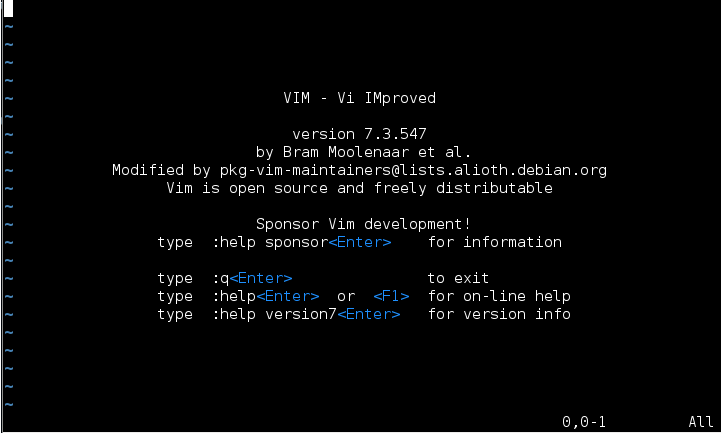

<!--
File          : 03.md

Created       : Tue 07 Jul 2015 22:58:41
Last Modified : Thu 06 Aug 2015 06:46:36
Maintainer    : sharlaran
-->

\[[02.00](./02.00.md "Среда разработки ")\]
# 03. Way of Codding - Редактор Vim #
\[[03.01.](./03.01.md "Настройка .vimrc")\]
\[[03.02.](./03.02.md "Плагины Vim")\]

  
[www.vim.org](http://www.vim.org)

## Вступление ##
_предупреждения и советы_

Если не понятны какие ни будь термины смотри часть \[[02](./02.md)\].  В этом разделе
я опишу текстовый редактор Vim, который будет основным инструментом в
разработке, програмировании и разборе кода. Если переходить сразу из Win среды в
*nix системы то возникают сложности, ты сам это поймешь когда сталкнешся с
большим количеством текстовой информации, ведь одна из "заповедей" философии
*nix "Все есть файл".

Статьи набираю как раз в этом редакторе. ;)

Время на обучение  
    основы  : 1 - 2 часа  
    выработка базовых навыков : неделя по 0.5 - 1 часа работы ежедневно  
    средний уровень : от месяца до 2х  
    выше среднего : до полугода  
    написание своих плагинов, раота с большим количеством файлом (до 1000) займет до
    года постоянной работы с редактомром  

На первый взгляд цифры большыи для редактора размер которого всего 4+Mb, но даже
выработка базовых навыков повысят скорость разработки и редактирования
исходников в десятки раз.

## О Vim ##
Все началось с редактора vi - читается как [ви], разработанного аж в 1976
и до сих пор работает ;) Биллом Джоем для ОС Unix...
[Wiki](https://goo.gl/3IYBH2)

Потом, как это часто происходит в проектах с открытым исходным кодом, решили vi
"проапгрейдить"  результатом работы стал редактор Vim - Vi IMproved, написанный
в 1991 году Брамом Моленаром и поддерживаемый им до сих пор ( Sat 11 Jul 2015
07:44:34) [Wiki](https://goo.gl/TUYlgX)

В отличие от других текстовых редакторов Vim уникален тем, что имеет несколько
режимов работы: _normal mode, insert mode, visual mode, replacemant mode, command
mode_. Каждый режим, вкратце, опишу чуть ниже. 

Он доступен практически на всех серверах под GNU/Linux и является бесплатным ПО.
Может быть установлен практически на любые доступные платформы, полный список на
сайте разработчик. Удобно при настройке сервера удаленно, удобен быстрой
конфигурацией, скоростью редактирования текста, да еще кучу всяких плюшек в нем
заложено. Одна из основных это возможность расширить функционал за счет
плагинов, тем самым увеличивая возможности редактора до бесконечности! Плагины
можно писать самому.

### основны ###

Так выглядит редактор запущенный в консольном режиме, если испугался жми сразу:

    :q

что бы выйти из этой дыры пережитков прошлого, но если еще горят желанием  глаза
ои чешутся пальцы своить действительно, что то стоящее и интересное то засучи
руква и проходи мануал от разработчика

    $: vimtutor

А пока опишу первые трудности, при знакомстве с Vim.

#### normal mode ####
_нормальный режим_

Когда ты только запускаешь его он в нормальном режиме. В этом режиме
каждой клавише на клавиатуре соответствует как нибудь команда редактирования,
передвижения или изменения текста. в этом режиме работать предстоит больше всего
времени. Первая проблема если запущен Vim в терминале, как из него выйти?

    :q

сокращенно от quit. Нажать двоеточии и потом q, если будет ругаться, что не
сохранены данные:

    :q!

выйти без сохранения

Сразу вырабатывай привычку возвращатся в основной режим (поэтому и основной),
жми Esc, Ctr-[, Ctr-c после любого режима.

#### insert mode ####
_режим вставки_

В этом режиме мы будем вводить текст которого еще нет, но после нескольких минут
эксперементов, ты можешь уловить логику. Работа в редакторе осуществляется мини
циклами:
    режим вставки ->
    ввод текста (если файл пуст)->
    возврат в нормальный режим->
    редактирование текста

Самый быстрый способ войти в режим вставки:

    i

сокращение от insert. И сразу можно вводить текст, который вставится от текущего
символа слева.

    I

начать набор текста с начала строки.

    a

сокращение от append. Текст будет вставлятся от текущего символа с права.

    A

печать с конца строки

#### visual mode ####
режим визуальный/выделения

Это режим похож как если бы ты пользовался мышкой для выделения текста.

    v

и передвигать курсор по тексту, будет выделятся как мышкой.

    V

будут выделятся целые строки

    C-v

будут выделятся блоки/столбцы

#### command mode ####
командный режим

Ты уже пробовал командный режим, пытаясь выйти из редактора

    :

двоеточие потом команда которую хочешь ввести, например

    :wq

сохранить и выйти, (да команды можно комбинировать !)

Подробная справка о каждом режиме доступна в самом Vim, например 

    :h Insert
    :h Visual
    :h Command
    :h :

покажет описане одного из режимов.

#### Файл настройки Vim'a ####

    /homve/user_name/.vimrc

В него записываются желаемы настройки при загрузке Vim. Может быть совсем
маленьким, буквально пару строк, как мой в начале, и может разростить до
бесконечности...

Пробуем найти .vimrc

    $: cd
    $: vim .vimrc 

в самом редакторе вводим (как есть)

    i
    set nu
    set rnu
    <Esc>
    :wq

и попробуй снова отрыть файл, в самом же Vim

    $: vim .vimrc

включатся глобальные номера строк и относительные.

Папка, где будут размещаться плагины для редактора

    /homve/user_name/.vim

### Руководства ###
_пройти для начального понимания_

Я не ставлю задачей описать все возможности редактора. Для этого существует уже
множество руководств и курсов. Самое доступное и необходимое для начала работы
это встроенное руководство для новичков:

    $: vimtutor

прохождение займет от получаса до 2х часов времени на освоение работы с Vim

### Команды ###
_не все, но важные для начала_

Более подробно, как обычно либо google, либо читай справку в самом редакторе,
замечу, очень добротная

    :h            -   справка
    :h команда    -   справкa  о команде
    :q            -   выйти
    :q!           -   выйти без сохранения
    :wq           -   выйти сохранившись
    :w            -   сохранить изменения
    :w!           -   перезаписать, игнорирую предупреждения

    :s/что найти/на что заменить/g    -    найти и заменить во всем файле
    /что найти    -  поиск по тексту внизу
    ?что найти    - поиск по тексту вверх

    yy или Y   -  скопировать строку целиком
    dd или В   -  вырезать строку целиком
    p          -  вставить ниже текущей строки
    P          -  вставить выше текущей строки
    gg         -  перейти к началу файла
    G          -  перейти в конец
    номерG     -  к строке под номером
    H(high)    -  перейти к верхней строке на экране
    L(low)     -  к нижней строке
    M(midle)   -  в середине 
    )          -  на обзац ниже
    (          -  на обзац выше 

Откровение от Моленара разрывающая мозг, опасно для жизни!

    поместить курсор между скобок
    ci)   -   удалить текст МЕЖДУ скобок и начать редактировать
    ci]   -  между квадратных скобок
    ci"   -  между кавычек
    ci>  -   между тегов

## Ссылки ##
__txt__  
[Vim How to](https://help.ubuntu.com/community/VimHowto)  
[Vim tips](http://rayninfo.co.uk/vimtips.html)  

[100 команд Vim](https://scabere.livejournal.com/62886.html)  

__casts__  
[Darek's Wyatt blog](www.derekwyatt.org)  
[Vim Casts](http://vimcasts.org/)  

\[[←](./02.00.md "Среда разработки")\]
\[[↑](./03.00.md#03-way-of-codding---Редактор-vim "Вверх")\]
\[[→](./03.01.md "Настройка .vimrc")\]
